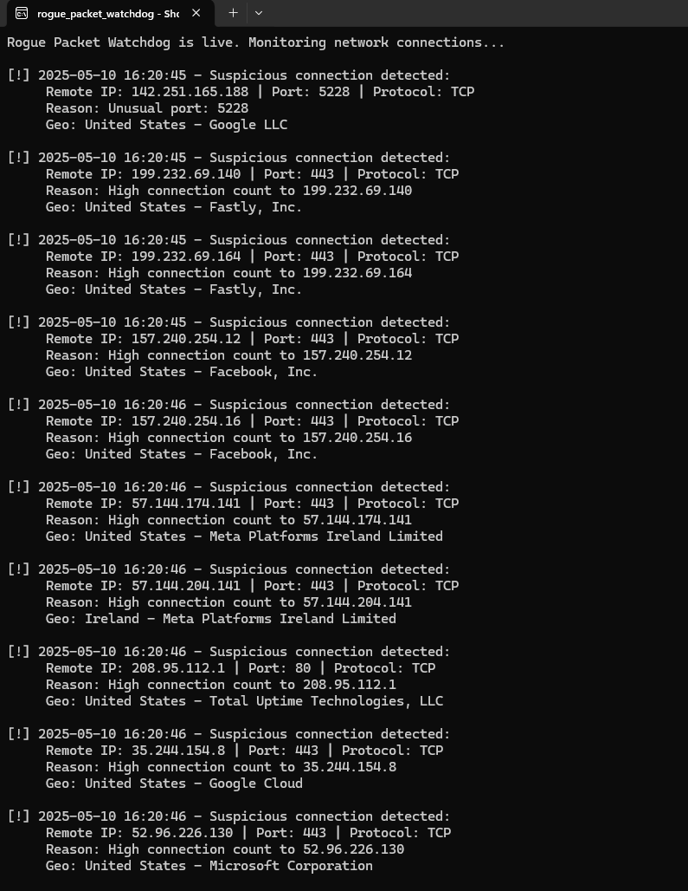

# CyberSec-Lab-Scripts
A collection of basic cybersecurity scripts in Bash, Python, and PowerShell
# CyberSec-Lab-Scripts

A collection of simple, real-world cybersecurity scripts for threat detection, network scanning, log analysis, and incident response.

Built as part of my transition into cybersecurity, this repo showcases practical skills using Bash, Python, and PowerShell. These scripts are designed for beginners and junior analysts to demonstrate hands-on ability with real-world tools and scenarios.

---

## 🔧 Scripts Included

### 🛠️ Network Scanning
- **basic_nmap_scan.sh**  
  Performs a basic TCP SYN scan with version detection using Nmap.

### 📜 Log Parsing
- **failed_login_parser.py**  
  Parses `/var/log/auth.log` to identify failed SSH login attempts.

### 🕵️‍♂️ Threat Intelligence
- **hash_lookup_script.py**  
  Queries VirusTotal API to fetch reputation data for file hashes. *(API key required)*

### 🚨 Incident Response
- **isolate_machine.ps1**  
  PowerShell script to isolate a compromised Windows host by blocking all network connections via firewall rules.

## 🧪 SIEM & Endpoint Monitoring

### `usb_insert_detector.sh`
Monitors Linux system logs for USB device insertions and logs alerts to a local file. Useful in SOC/Blue Team environments for identifying unauthorized devices.

---

## 🎯 Skills Demonstrated
- Bash scripting
- Python for automation and analysis
- PowerShell for host-level response
- Network security fundamentals
- Threat intelligence APIs
- Log analysis
- Incident containment

---

## 📫 About Me
I’m transitioning into cybersecurity with a Master’s in Information Systems (March 2026) and certifications including ISC2 CC (May 2025) and SSCP (June 2025). My goal is to contribute to a SOC or SecOps team while continuing to grow into cloud and system security.

Connect on [LinkedIn](http://linkedin.com/in/philliplgross) or reach me at `philgross22@icloud.com`.
---

## 🧠 rogue_packet_watchdog

**Rogue Packet Watchdog** is a custom-built Python script that monitors live network traffic for suspicious behavior, such as:

- Connections to uncommon ports
- Excessive connections to a single IP (possible C2 or brute-force behavior)
- Geolocation of remote IPs using public APIs

### 🔍 Features

- Real-time detection using `psutil`
- Logs alerts to `suspicious_connections.csv`
- Integrates with `ip-api.com` to identify country + organization
- Flag logic based on port usage, volume, and source

### 🧪 Sample Alert

[!] 2025-05-10 15:47:46 - Suspicious connection detected:
Remote IP: 20.59.87.227 | Port: 443 | Protocol: TCP
Reason: High connection count to 20.59.87.227
Geo: United States - Microsoft Azure Cloud (westus)

### 📸 Example Output

### 📂 Location
`/rogue_packet_watchdog/rogue_packet_watchdog.py`

### 🔧 Future Improvements
- Country-based filtering
- Auto-blocking IPs via Windows Firewall
- Optional email alerting or dashboard output

